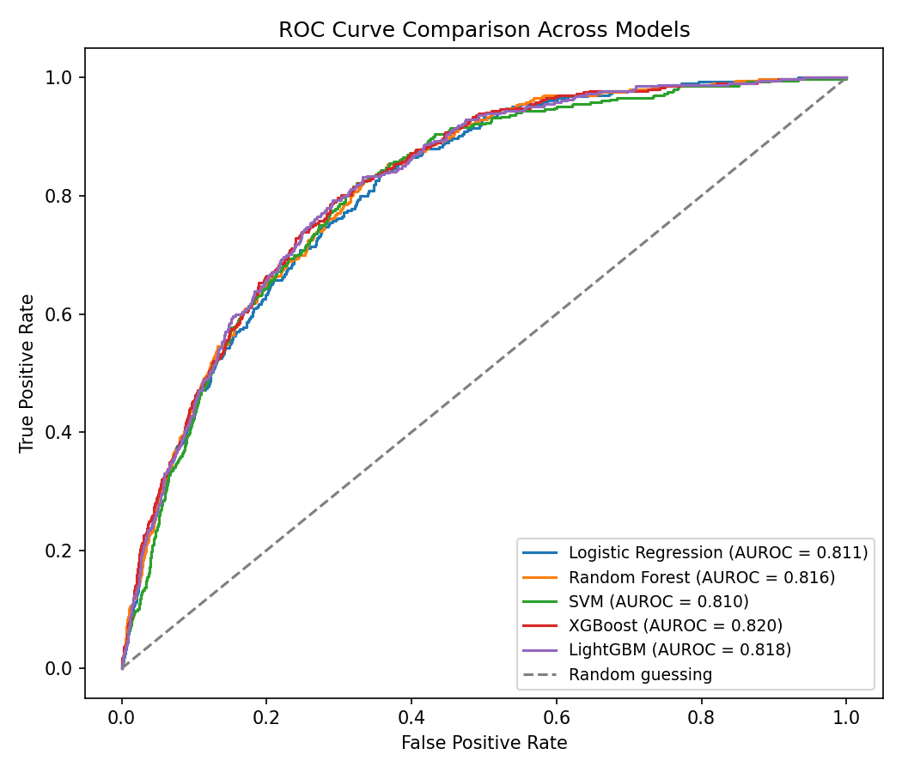
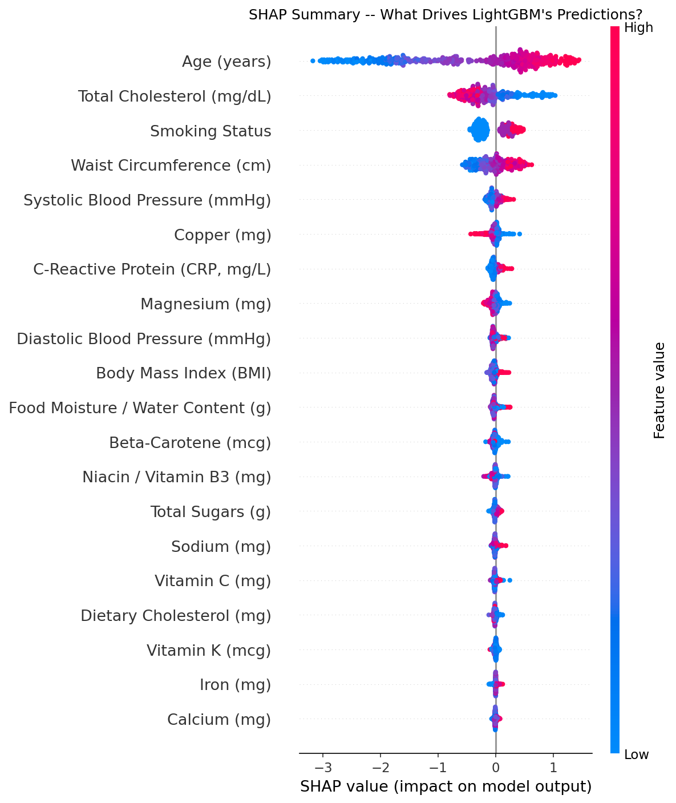
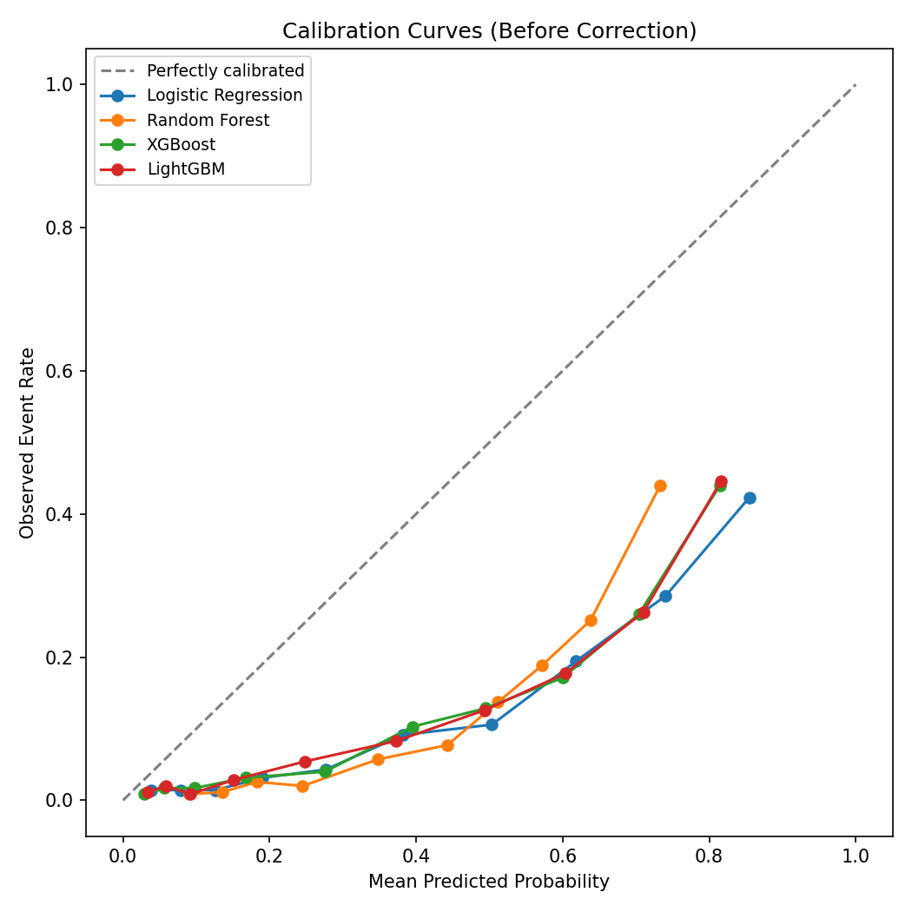
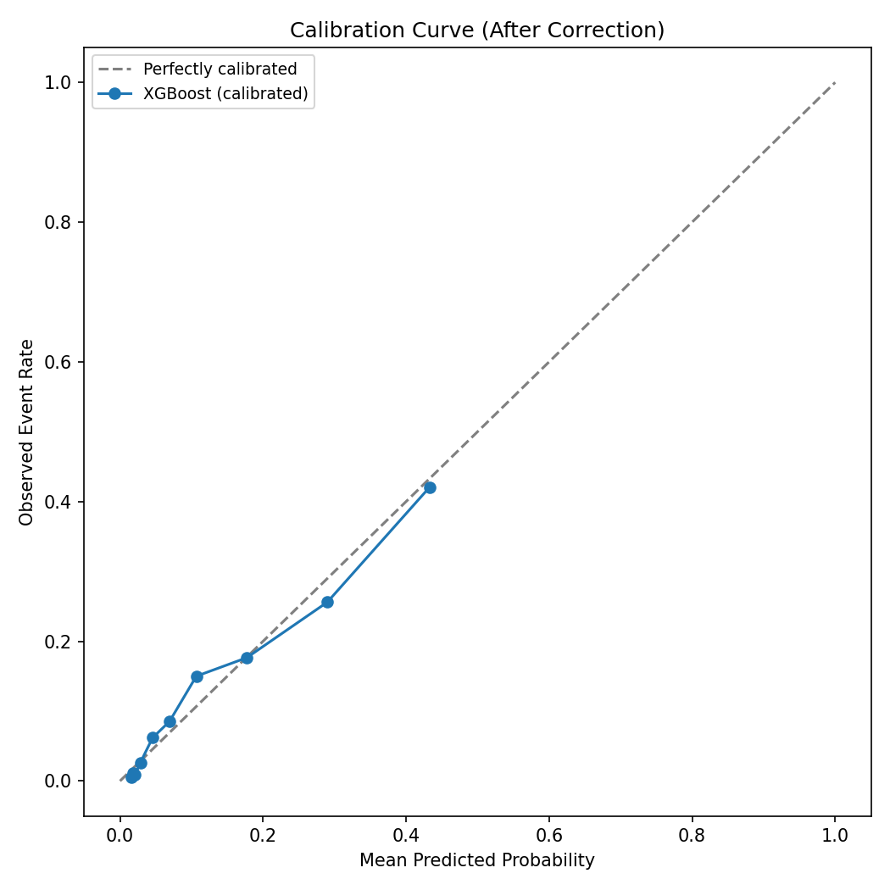
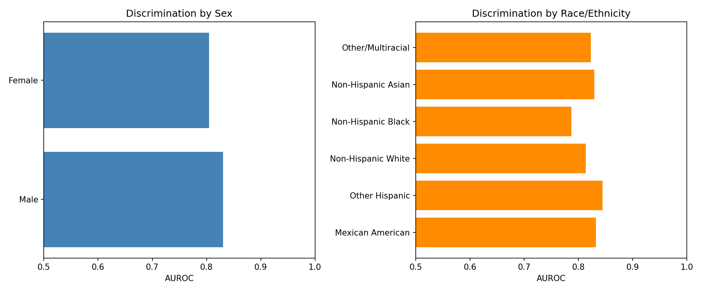

# Cardiovascular Disease Risk Prediction from NHANES Data

A machine learning pipeline that estimates cardiovascular disease (CVD)
risk from age, blood pressure, cholesterol (total and HDL), kidney
function, diabetes status, smoking status, body measurements, and
dietary intake, using public U.S. health survey data (NHANES). The
project emphasizes methodological rigor: leakage-safe cross-validation,
real hyperparameter tuning, verified and corrected probability
calibration, and a subgroup fairness audit.

Inspired by Ahiduzzaman & Hasan (2025), *"Interpretable machine learning
for cardiovascular risk prediction,"* PLoS One. Smoking status, HDL
cholesterol, diabetes status, and estimated kidney function (eGFR) are
included here as additional predictors beyond the original paper's
scope, mirroring inputs used by established clinical risk tools such as
the ACC/AHA Pooled Cohort Equations and the AHA PREVENT calculator.

## Interactive Demo

**[Try the live risk calculator](https://nhanes-cvd-risk-prediction-iiweewaykdo883ffw3cksj.streamlit.app/)**

Enter a hypothetical patient's clinical, smoking, diabetes, and dietary
values to obtain a calibrated risk estimate with a SHAP-based
explanation of the prediction.

To run it locally instead:
```bash
streamlit run app/streamlit_app.py
```

## Key Results

**All five models tested achieve comparable discrimination** (AUROC
≈ 0.81-0.82), with overlapping bootstrap confidence intervals --
indicating no single algorithm provides a meaningful advantage on this
task:



**Age, total cholesterol, and waist circumference are the strongest
overall predictors. Notably, all three newly added clinical
predictors -- estimated kidney function (eGFR), diabetes status, and
HDL cholesterol -- rank among the top 6**, each showing the clinically
expected direction of effect:



**Raw predicted probabilities were poorly calibrated** -- every model
systematically overestimated risk, a direct consequence of training on
oversampled data. This was identified and corrected via post-hoc
calibration:

| Before Calibration | After Calibration |
|---|---|
|  |  |

**Subgroup fairness audit:** model discrimination was evaluated
separately by sex and by race/ethnicity (neither used as a model input)
to assess whether performance is consistent across demographic groups:



AUROC ranged from approximately 0.79 (Non-Hispanic Black participants)
to 0.84 (Other Hispanic participants) across race/ethnicity groups, and
from 0.80 (female) to 0.83 (male) by sex. These gaps are reported
directly, with sample-size caveats and guidance on interpretation, in
[`model_card.md`](model_card.md).

## Methodological Notes

Two data leakage issues were identified and corrected during
development, documented in the notebook at the point they occurred:

1. **Feature selection performed on the full dataset prior to the
   train/test split** allows test-set information to influence which
   variables are selected. Corrected by restricting feature selection
   to the training partition only.
2. **Oversampling applied once, prior to cross-validation**, allows
   duplicate observations (produced by the oversampling process) to
   span both the training and validation partitions of a fold,
   inflating validation performance. This was identified during
   development, where it produced a cross-validated AUROC of 0.99 --
   implausibly high for this task. It was corrected by encapsulating
   oversampling as a pipeline step, refit independently within each
   cross-validation fold.

**A note on smoking status:** smoking status was not selected by the
automatic feature selection step in the current run. This does not
indicate smoking is unimportant for cardiovascular risk in general --
its signal likely overlaps with the other newly added predictors
(diabetes, kidney function, HDL), and Recursive Feature Elimination
tends to keep one representative of a correlated cluster of risk
factors rather than all of them. See `model_card.md` for further
discussion.

## Repository Structure

```
├── CVD_Risk_Prediction.ipynb   # complete analysis, single notebook
├── data/
│   ├── README.md               # data source and expected format
│   └── nhanes_cvd_extract.xlsx # NHANES extract (2015-2016, 2017-2020, 2021-2023)
├── figures/                    # figures generated by the notebook
├── app/
│   └── streamlit_app.py        # interactive risk calculator
├── model_card.md                # model documentation, including fairness audit
└── requirements.txt
```

## Running This Project

```bash
pip install -r requirements.txt
```

1. The NHANES data extract is already included in `data/` (see
   `data/README.md` for how it was built).
2. Open `CVD_Risk_Prediction.ipynb` and run all cells, top to bottom.
3. Optionally, launch the interactive demo:
   `streamlit run app/streamlit_app.py`

## Limitations

This is a portfolio/research project and is not a validated clinical
tool. See [`model_card.md`](model_card.md) for a complete discussion of
limitations, including the subgroup fairness findings above.

## Acknowledgments

Approach inspired by Ahiduzzaman, M. & Hasan, M.N. (2025). Interpretable
machine learning for cardiovascular risk prediction: Insights from
NHANES dietary and health data. *PLoS One, 20*(11), e0335915.
https://doi.org/10.1371/journal.pone.0335915

Data source: [NHANES](https://www.cdc.gov/nchs/nhanes), National Center
for Health Statistics (public, de-identified).
