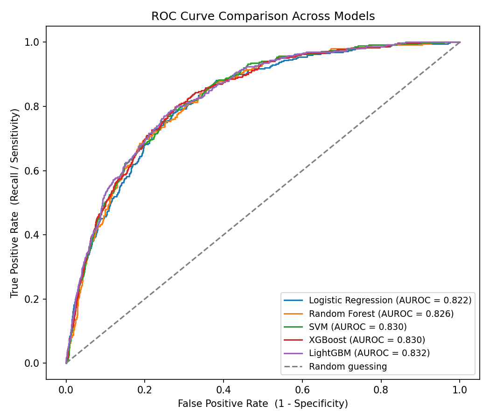
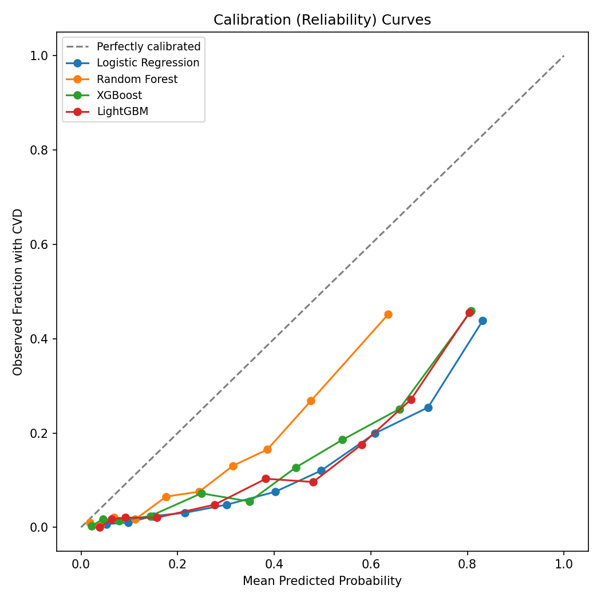
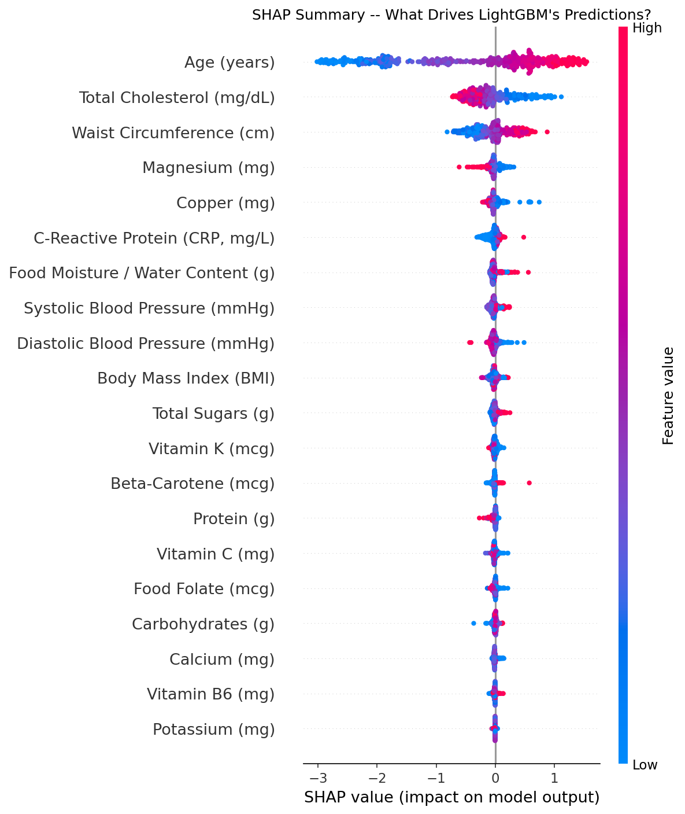

# NHANES Cardiovascular Disease Risk Prediction

An end-to-end, methodologically careful machine learning pipeline that
predicts cardiovascular disease (CVD) risk from dietary, clinical, and
demographic data — with real hyperparameter tuning, leakage-safe
cross-validation, calibrated probabilities, a subgroup fairness audit,
and an interactive risk calculator.

Inspired by Ahiduzzaman & Hasan (2025), *"Interpretable machine learning
for cardiovascular risk prediction,"* PLoS One — this project
independently re-implements the general approach on the same public
dataset, then goes further: fixing two subtle data-leakage issues,
adding real hyperparameter search, checking (and fixing) probability
calibration, and auditing the model for performance gaps across
demographic subgroups.

**[Try the interactive risk calculator](#interactive-risk-calculator)** · **[See the model card](model_card.md)**

---

## Why this project

Most tutorial-style ML projects stop at "here's an AUROC number." This
one is built to demonstrate the parts of applied ML that actually matter
in a health-tech setting: does the evaluation avoid leakage, are the
predicted probabilities trustworthy, and does the model work equally
well for everyone it might be used on?

## Key findings

- **All 5 models (Logistic Regression, Random Forest, SVM, XGBoost,
  LightGBM) land in a tight AUROC band (~0.82-0.83) with heavily
  overlapping bootstrapped 95% confidence intervals** — meaning no
  single algorithm is statistically distinguishable from the others on
  this task. Algorithm choice barely matters here; feature quality and
  correct evaluation do.
- **Raw model probabilities were badly miscalibrated** — every model
  substantially over-predicted risk, a direct side effect of training on
  oversampled data. Post-hoc calibration (Platt scaling) corrected this
  (Brier score roughly halved) while leaving AUROC essentially
  unchanged.
- **Two real data-leakage bugs were found and fixed during development**
  (see [Methodology](#methodology)) — including one that inflated a
  model's cross-validated AUROC to an implausible 0.99 before the fix.
- **A subgroup fairness audit reveals real performance gaps**: AUROC
  ranges from ~0.75 (Non-Hispanic Black participants) to ~0.92
  (Non-Hispanic Asian participants) across race/ethnicity groups never
  used as model inputs — reported transparently with appropriate sample-
  size caveats in the [model card](model_card.md).
- **Age, total cholesterol, and waist circumference are the dominant
  predictors** across every model tested, consistent with established
  cardiovascular risk literature.

## Results

### Model performance

| Metric | XGBoost | Random Forest | Logistic Regression | LightGBM | SVM |
|---|---|---|---|---|---|
| Accuracy | 0.763 | 0.857 | ~0.72 | 0.736 | 0.709 |
| AUROC | 0.830 | 0.826 | 0.822 | **0.832** | 0.830 |

*(Full table with Precision/Recall/Specificity/F1 in
`results/performance_table.csv`; bootstrapped confidence intervals in
`results/auroc_confidence_intervals.csv`.)*



### Calibration: before and after correction

Training on oversampled data taught every model to over-predict risk.
Post-hoc Platt scaling fixes this:



### What drives the predictions (SHAP)



### Individual explanations (LIME)

Three example test-set individuals, each with a person-specific
breakdown of what pushed their predicted risk up or down —
`results/lime_example_case_*.png`.

### Fairness audit

See `results/fairness_audit_by_sex.csv`, `_by_race_ethnicity.csv`, and
`_by_age_band.csv`, discussed in full (with appropriate caveats) in the
[model card](model_card.md).

## Interactive risk calculator

```
streamlit run app/streamlit_app.py
```

Enter a hypothetical person's clinical and dietary values and get a
calibrated risk estimate plus a personalized SHAP explanation of what
drove that specific prediction.

## Methodology

1. **Data preparation** (`src/data_prep.py`) — NHANES 2017-2023, adults
   only, complete-case filtering on dietary data, MICE-style imputation
   for the small remaining gaps in clinical measurements.

2. **Train/test split BEFORE feature selection.** *(Correctness fix
   #1.)* Running feature selection on the full dataset before splitting
   lets the test set quietly influence which variables get chosen — a
   common but real leakage bug. Here, Recursive Feature Elimination
   (`src/feature_selection.py`) only ever sees the training split.

3. **Oversampling wrapped inside cross-validation, not applied once
   upfront.** *(Correctness fix #2.)* `RandomOverSampler` works by
   duplicating minority-class rows. Oversampling once and then
   cross-validating on that data lets an exact duplicate of the same
   person land in both a fold's training and validation portion —
   letting the model partially "see" its own validation answer. This
   was caught directly during development: it inflated a model's
   cross-validated AUROC to an implausible **0.99**. The fix
   (`src/modeling.py`) wraps oversampling as a step inside an
   `imblearn` Pipeline, so it happens fresh, independently, inside every
   fold.

4. **Real hyperparameter tuning.** Every model is tuned via
   `RandomizedSearchCV` (not copied from literature defaults), with
   search spaces sized to run in a few minutes on modest hardware.

5. **Evaluation** (`src/evaluation.py`) — standard metrics, ROC curves,
   bootstrapped AUROC confidence intervals (2,000 resamples), and
   calibration curves with Brier scores before/after Platt scaling.

6. **Fairness audit** (`src/fairness.py`) — test-set performance broken
   down by sex, race/ethnicity (neither used as predictors), and age
   band.

7. **Interpretability** (`src/interpret.py`) — SHAP (global) and LIME
   (per-person) explanations for the best-performing tree-based model.
   No variables are manually forced into or out of the model to match
   any external source; whatever RFE selects is what gets used and
   interpreted.

## Repo structure

```
├── run_analysis.py          # main entry point -- runs the full pipeline
├── src/
│   ├── config.py            # paths, variable lists, readable names
│   ├── data_prep.py         # loading, cleaning, imputation
│   ├── feature_selection.py # leakage-safe RFE
│   ├── modeling.py          # train/test split, tuning, leakage-safe oversampling
│   ├── evaluation.py        # metrics, ROC, bootstrap CI, calibration
│   ├── fairness.py          # subgroup performance audit
│   └── interpret.py         # SHAP + LIME
├── app/
│   └── streamlit_app.py     # interactive risk calculator
├── results/                 # generated tables and figures
├── model_card.md            # full model documentation
└── requirements.txt
```

## How to run

```bash
pip install -r requirements.txt
```

Edit `RAW_DATA_PATH` in `src/config.py` to point at your NHANES extract,
then:

```bash
python run_analysis.py       # trains everything, populates results/
streamlit run app/streamlit_app.py   # launches the interactive calculator
```

Data source: [NHANES](https://www.cdc.gov/nchs/nhanes), National Center
for Health Statistics (public, de-identified).

## Limitations

See the [model card](model_card.md) for the full discussion, including
self-reported outcome data, cross-sectional design (no causal claims),
missing medication-use data, and the fairness audit's sample-size
caveats. This is a portfolio/research project, not a validated clinical
tool.

## Acknowledgments

Approach inspired by Ahiduzzaman, M. & Hasan, M.N. (2025). Interpretable
machine learning for cardiovascular risk prediction: Insights from
NHANES dietary and health data. *PLoS One, 20*(11), e0335915.
https://doi.org/10.1371/journal.pone.0335915
